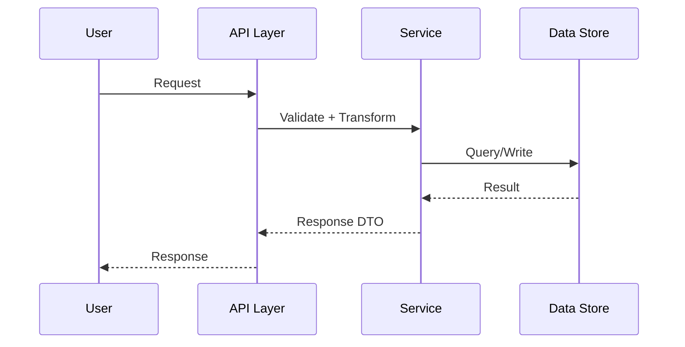
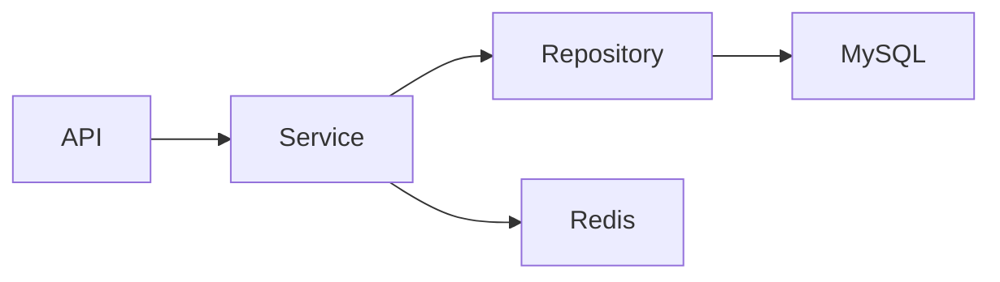
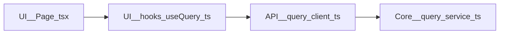

# Workspace System Wiki

用于分析整个工作空间或指定目录，并输出“全局 + 模块深描”的可落地系统 Wiki 文档。

该技能在保留原有“整体能力介绍”（架构、数据流、权限、接口、依赖）的基础上，新增类似 DeepWiki 的细粒度模块解析能力（模块卡片、文件引用关系、模块关系图、证据链追踪）。

## 适用场景

- 用户提到“分析项目结构/架构”“梳理数据流”“权限链路分析”“对外接口盘点”“生成 wiki 文档”。
- 用户需要“全局视角 + 依赖关系”，而不是单文件说明。
- 用户明确希望“像 DeepWiki 一样”按模块拆解并提供详细解释。
- 用户要求给出模块之间、文件之间的引用/依赖关系和可追溯证据。

## 输入约定

如果用户未给全量参数，先补齐以下默认值并在结果中声明：

- `scope`: 整个 workspace（默认）或用户指定目录。
- `output_path`: `docs/system-wiki.md`（默认）。
- `depth`: `medium`（默认）；超大型仓库用 `quick`，核心系统治理用 `very thorough`。
- `module_granularity`: `feature-first`（默认，按业务/能力模块拆分）；必要时可切换 `layer-first`（按分层拆分）。
- `include_file_relations`: `true`（默认，必须输出文件引用关系图与关系表）。

## 执行流程

1. 定义分析范围  
   - 明确目录边界、排除项（如 `dist/`、`build/`、生成物、压缩包）。
2. 代码探索  
   - 优先使用 `Subagent`（`explore`）进行结构化探索。  
   - 大仓可并行启动多个子任务（如 API、数据层、权限层）。
3. 从“真实可运行入口”建立能力基线（新增，强制）  
   - 优先定位服务启动入口（如 `main`、`bootstrap`、`server entry`、路由注册入口）。  
   - 同时定位外部输入接口（HTTP/RPC/CLI/Event/Webhook/Queue Consumer/Cron Trigger）。  
   - 仅基于“可到达路径”盘点对外能力，避免被历史遗留代码干扰。  
4. 对外能力盘点与原子拆分（新增，强制）  
   - 先列出“系统全部对外能力清单”（按入口来源分组）。  
   - 再将每个能力拆分为 `Capability` 原子节点。  
   - 在原子节点层面建立依赖关系（内部模块依赖、workspace 依赖、外部依赖）。  
5. 建立模块分解视图（DeepWiki 风格）  
   - 识别模块边界：目录边界、职责边界、依赖边界、运行边界。  
   - 生成模块清单：每个模块必须有名称、职责、关键文件、入口/出口。  
   - 对每个模块建立“证据链”：至少 2 个文件或 1 个符号链路支撑结论。  
6. 提取五类核心信息（保留）  
   - 重点数据结构：实体/DTO/VO、配置模型、核心上下文对象。  
   - 数据流：入口 -> 校验 -> 转换 -> 存储/返回 的关键路径。  
   - 权限控制流：身份来源 -> 鉴权点 -> 权限决策 -> 拒绝/放行。  
   - 对外接口与能力：HTTP/RPC/CLI/Event/Webhook 等入口与能力边界。  
   - 依赖关系：模块依赖、运行时调用依赖、对外服务依赖。
7. 提取文件引用关系（新增，强制）  
   - 统计至少三类关系：`import/use`、`call`、`config-bind`。  
   - 标注关系方向：`source -> target`。  
   - 标注关系证据：文件路径、符号名（函数/类/常量/路由名）。  
8. 冗余代码识别（新增，强制）  
   - 以“能力基线 + 可到达调用链”为参照，标记未被任何对外能力覆盖的代码。  
   - 重点识别：废弃路由、未注册服务、孤儿模块、仅被旧入口引用的逻辑。  
   - 输出“疑似冗余”分级（High/Medium/Low）和验证建议。  
9. 交叉验证  
   - 至少给出 1 条“主业务链路”端到端路径。  
   - 对每个“对外接口”标注其依赖的内部模块。  
   - 对每个“权限决策点”标注触发条件与结果。
   - 对每个“模块结论”给出可追溯文件证据。
10. 生成并保存 Wiki  
   - 按模板组织文档，输出到 `output_path`。  
   - 若目录不存在，先创建目录再写文件。
11. 回传结果  
   - 告知文档路径、覆盖范围、已知盲区和下一步建议。

## 图示要求（Mermaid）

- 数据流与权限控制流优先使用 `mermaid sequenceDiagram`。
- 依赖关系优先使用 `mermaid graph LR` 或 `mermaid graph TD`。
- 文件引用关系优先使用 `mermaid graph LR`（节点建议为“模块::文件”）。
- 表格用于补充字段、约束和说明；不要只给表格不画图。
- 若仓库信息不全，图中节点可用“待确认”标记，但不得伪造连线。

示例：

## 输出格式要求

严格按以下章节顺序输出（可引用模板）：

0. 系统定位与核心功能快照（新增，首屏必读）  
1. 背景与范围  
2. 系统分层与模块地图  
3. 重点数据结构  
4. 数据流（主链路 + 支链路，含 sequenceDiagram）  
5. 权限控制流（含 sequenceDiagram）  
6. 对外接口与能力原子关系图谱（含 graph / sequenceDiagram）  
7. 依赖关系总览（内部/外部，含 graph）  
8. 模块深度解析（新增，逐模块）  
9. 文件引用关系矩阵（新增）  
10. 冗余代码与疑似废弃路径分析（新增）  
11. 风险与待确认项  
12. 当前问题与建议优化方向

### 第 0 章（系统定位与核心功能快照）固定要求

该章节必须让读者在 60 秒内回答三个问题：  
- 这个系统主要是干什么的？  
- 主要服务谁（用户/上下游系统）？  
- 最核心功能是什么（Top 3~7）？

固定结构如下：

**0.1 一句话定位（必填）**
- 模板：`这是一个面向 <用户/系统> 的 <业务类型> 系统，核心目标是 <核心价值>`。

**0.2 核心功能清单（必填，Top 3~7）**
- 每条功能必须包含：`功能名`、`Capability ID`、`用户价值`、`关键入口`、`状态(active/legacy)`。

| 功能名 | Capability ID | 用户价值 | 关键入口 | 状态 |
| --- | --- | --- | --- | --- |
| `<查询提交>` | `CAP-QuerySubmit` | `<提升处理效率>` | `POST /query/submit` | `active` |

**0.3 业务主闭环（必填）**
- 用 3~5 步描述端到端价值闭环：`触发 -> 处理 -> 结果 -> 反馈`。

**0.4 非目标与边界（必填）**
- 明确系统“不负责什么”，避免范围误读。

要求：第 4/6/8/10 章中的能力、链路、模块都应尽量引用第 0 章中的 `Capability ID`，保持叙事一致。

### 模块深度解析（第 8 章）固定模板

先输出“模块导航”，再逐模块展开，禁止把所有模块堆成一个长列表。

#### 8.0 模块导航（必填）

| 模块 | 职责一句话 | 关键入口 | 风险等级 |
| --- | --- | --- | --- |
| `M-01 <模块A>` | `<...>` | `<...>` | `High/Medium/Low` |
| `M-02 <模块B>` | `<...>` | `<...>` | `High/Medium/Low` |

#### 8.N 模块卡片（每个模块一个独立小节）

每个模块必须用二级小节独立展开，格式如下：

`### 8.x [M-xx] <模块名>`

**A. 模块概览**

| 字段 | 内容 |
| --- | --- |
| 模块ID | `M-xx` |
| 职责 | `<做什么 / 不做什么>` |
| 入口 | `<API/Route/Event/Page>` |
| 出口 | `<DB/Queue/External Service>` |
| 关键数据结构 | `<XCommand>, <XResult>` |
| 风险等级 | `High/Medium/Low` |

**B. 关系与实现要点**

| 项 | 内容 |
| --- | --- |
| 依赖输入 | `<module-b>, <config-x>` |
| 对外输出 | `<module-c>, <event-y>` |
| 核心符号 | `<createX()>, <XService.execute>` |
| 典型调用链 | `<source> -> <...> -> <sink>` |
| 变更风险 | `<高耦合点/隐式约束/回归风险>` |

**C. 关键文件（必填）**

| File | Role |
| --- | --- |
| `<src/module-a/index.ts>` | `<入口/装配>` |
| `<src/module-a/service.ts>` | `<核心编排>` |
| `<src/module-a/types.ts>` | `<模型定义>` |

**D. 证据（必填，至少 2 条）**

| Evidence Type | File/Symbol | 说明 |
| --- | --- | --- |
| file | `<src/module-a/service.ts>` | `<实现核心编排>` |
| symbol | `<XService.execute>` | `<主执行入口>` |

建议使用 `M-01/M-02/...` 的稳定编号，便于跨章节引用（如在第 9/10/12 章回指模块）。

### 文件引用关系矩阵（第 9 章）固定要求

- 必须同时提供“关系图 + 关系表”。  
- 关系表最少字段如下：

| Source File | Target File | Relation Type | Symbol/Entry | Evidence |
| --- | --- | --- | --- | --- |
| src/pages/query/index.tsx | src/hooks/useQuery.ts | import/use | useQuery | import line + usage |

- `Relation Type` 推荐枚举：`import/use`、`call`、`inherit/impl`、`config-bind`、`event-subscribe`、`io-dependency`。
- 对跨模块关系，增加 `Cross-Module: Yes/No` 标记。

### 冗余代码分析（第 10 章）固定要求

- 必须基于“服务启动入口 + 外部输入接口”的能力盘点结果来判断，不能只看静态 import。  
- 每条疑似冗余都要给出“为什么疑似无用”与“如何验证”。
- 最少字段如下：

| Code Path/Symbol | Suspect Level | Why Suspect | Last Reachable Entry | Validation Plan |
| --- | --- | --- | --- | --- |
| src/legacy/job.ts::runLegacyJob | High | no active entry references | none | canary remove + runtime check |

说明：若代码仅支撑 `legacy` 功能且不在第 0 章核心功能清单内，应优先作为冗余候选评估。

依赖关系需要“Mermaid 图 + 表格”双表达：

| Source | Depends On | Type | Why |
| --- | --- | --- | --- |
| module-a | module-b | runtime call | query user profile |

对外能力必须“原子化拆分 + 关系建模”，最低要求：

- 必须先从服务启动入口和外部输入接口盘点“全部对外能力”，再做原子拆分。  
- 每个能力拆成 `Capability` 原子节点（如 `CAP-QuerySubmit`、`CAP-QueryExecute`）。
- 每个原子能力标注：输入、输出、触发条件、权限前置条件。
- 必须使用 Mermaid 图表达依赖边：  
  - 同 workspace 其他项目依赖（`workspace dependency`）  
  - 外部系统依赖（`external dependency`）  
- 表格仅作为补充，不得替代关系图。

## 质量门禁

- 不输出“泛化空话”，每一节至少包含具体对象/模块名。
- 结论可追溯到代码位置（文件或符号名）。
- 明确区分“已确认事实”与“推测/待确认”。
- 如果信息不足，显式列出 TODO，不得伪造。
- 第 0 章必须可独立阅读，且不依赖后文即可说明系统定位与核心功能。
- 模块章节必须覆盖“核心模块集合”（按系统重要性排序，不少于 3 个模块，微型项目除外）。
- 模块解析必须“先导航后展开”；每个模块单独小节，不得合并成连续大列表。
- 文件引用关系至少覆盖主链路涉及文件；不得只列 `index` 或 barrel 文件。
- 能力清单需覆盖所有已注册外部入口；必须显式标注“入口已确认/待确认”。
- 冗余代码判断必须附带验证计划（灰度、日志观测、调用统计或删除演练）。

## DeepWiki 风格增强规则（新增）

- 先全局后局部：先给系统地图，再给模块深描，最后回到风险与改进建议。  
- 每个模块用“可维护性视角”说明：可替换点、耦合点、扩展点。  
- 每个关键判断都要“带证据说话”：路径 + 符号 + 关系类型。  
- 图和表必须一致：图中的关键边必须在表里能找到。  
- 如果需要猜测，统一标记为 `Hypothesis`，并给出“如何验证”。
- 优先信任“运行入口可达链路”，避免把历史残留代码误判为主链路。

## 交付物约束

- 默认输出单文档：`docs/system-wiki.md`。  
- `depth=quick` 时优先使用轻量模板：`wiki-template-quick.md`，先输出能力基线与冗余候选。  
- 大型项目可拆分为：  
  - `docs/system-wiki.md`（总览）  
  - `docs/system-wiki-modules.md`（模块深描）  
  - `docs/system-wiki-file-relations.md`（文件引用关系）  
- 若拆分输出，主文档必须包含索引与跳转链接。

## 参考模板

- 详见 [wiki-template.md](wiki-template.md)
- 轻量版见 [wiki-template-quick.md](wiki-template-quick.md)
