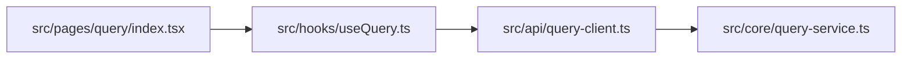

# 系统 Wiki 轻量模板（Quick 模式）

> 适用场景：超大型仓库首轮扫描、历史包袱重项目初筛、先定位主能力与冗余候选。  
> 输出目标：用最小成本产出“能力基线 + 核心链路 + 冗余候选 TopN”。  
> 分析范围：`<workspace 或目录>`  
> 更新时间：`<YYYY-MM-DD>`

---

## 0. 系统定位与核心功能快照（必填）

### 0.1 一句话定位

这是一个面向 `<用户/系统>` 的 `<业务类型>` 系统，核心目标是 `<核心价值>`。

### 0.2 核心功能 Top3（快照）

| 功能名 | Capability ID | 用户价值 | 关键入口 | 状态 |
| --- | --- | --- | --- | --- |
| `<查询提交>` | `CAP-QuerySubmit` | `<缩短处理时延>` | `POST /query/submit` | `active` |
| `<查询执行>` | `CAP-QueryExecute` | `<提升成功率>` | `<internal trigger>` | `active` |
| `<历史逻辑>` | `CAP-LegacyX` | `<历史兼容>` | `<legacy route/cron>` | `legacy` |

## 1. 背景与范围（精简）

- 目标：`<本次 quick 分析目标>`
- In-Scope：`<纳入分析目录>`
- Out-of-Scope：`<排除目录>`
- 分析限制：`<时间/上下文/权限限制>`

## 2. 启动入口与外部输入基线（必填）

> 先找“程序怎么启动、外部怎么进来”，再做能力分析。

| Type | Entry/Location | Status | Evidence |
| --- | --- | --- | --- |
| service startup entry | `<src/main.ts>` | `<confirmed/pending>` | `<bootstrap chain>` |
| external input | `<GET /api/x>` | `<confirmed/pending>` | `<route register>` |
| external input | `<queue topic-x consumer>` | `<confirmed/pending>` | `<consumer init>` |

## 3. 对外能力清单（原子化前）

| Capability (raw) | Source Entry | Business Intent | Status |
| --- | --- | --- | --- |
| `<QuerySubmit>` | `<POST /query/submit>` | `<提交查询请求>` | `<active/legacy/unknown>` |
| `<QueryStatus>` | `<GET /query/status>` | `<查询执行状态>` | `<active/legacy/unknown>` |

## 4. 原子能力拆分与依赖（核心）

### 4.1 原子能力图

### 4.2 原子能力表

| Capability ID | From Entry | Upstream | Downstream | Permission | Evidence |
| --- | --- | --- | --- | --- | --- |
| `CAP-QuerySubmit` | `POST /query/submit` | `<caller>` | `CAP-QueryExecute` | `<role-x>` | `<handler + service call>` |
| `CAP-QueryExecute` | `<internal trigger>` | `CAP-QuerySubmit` | `<ext-engine>` | `<policy-y>` | `<service + client>` |

> 要求：本章能力必须与第 0 章核心功能建立映射，避免“能画图但看不懂系统价值”。

## 5. 核心链路文件关系（TopN）

> 只覆盖主链路关键文件，避免一次性铺满全仓。

| Source File | Target File | Relation Type | Cross-Module | Evidence |
| --- | --- | --- | --- | --- |
| `src/pages/query/index.tsx` | `src/hooks/useQuery.ts` | `import/use` | `Yes` | `import + call` |
| `src/hooks/useQuery.ts` | `src/api/query-client.ts` | `call` | `Yes` | `function invocation` |

## 6. 疑似冗余代码候选（TopN）

> 基于“能力基线 + 可达链路”初筛，不等于最终可删结论。

| Rank | Code Path/Symbol | Suspect Level | Why Suspect | Validation Plan |
| --- | --- | --- | --- | --- |
| 1 | `src/legacy/old-route.ts::registerOldRoutes` | `High` | `<not linked from active startup>` | `<disable + observe 7d>` |
| 2 | `src/jobs/legacy-clean.ts::run` | `Medium` | `<only referenced by deprecated scheduler>` | `<feature flag off + metrics>` |

## 7. 风险与下一步

- 风险：`<quick 模式下可能漏检边缘链路>`
- 待确认：`<入口是否完整、运行时动态注册是否已覆盖>`
- 下一步建议：
  - `1)` 对 TopN 冗余候选做运行时调用验证
  - `2)` 对核心能力切换至完整版模板深挖
  - `3)` 若第 0 章仍不能说明系统价值，先补“用户场景与价值度量”再继续深挖

---

## 附：Quick 自检清单

- [ ] 是否先完成“启动入口 + 外部输入接口”基线盘点。
- [ ] 第 0 章是否能让读者在 60 秒内理解“系统是做什么的”。
- [ ] 是否覆盖所有已确认外部入口的能力映射。
- [ ] 是否给出原子能力依赖而非仅列接口名。
- [ ] 是否对每条冗余候选提供验证计划。
- [ ] 是否明确说明 quick 结论的边界与不确定性。
