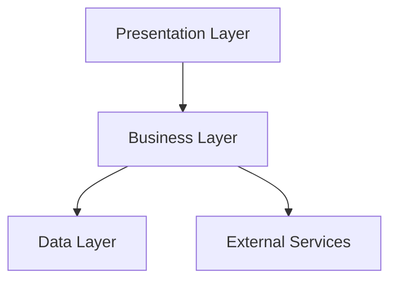
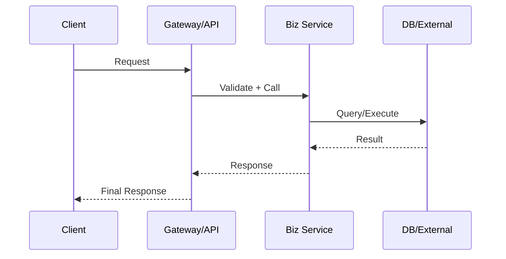
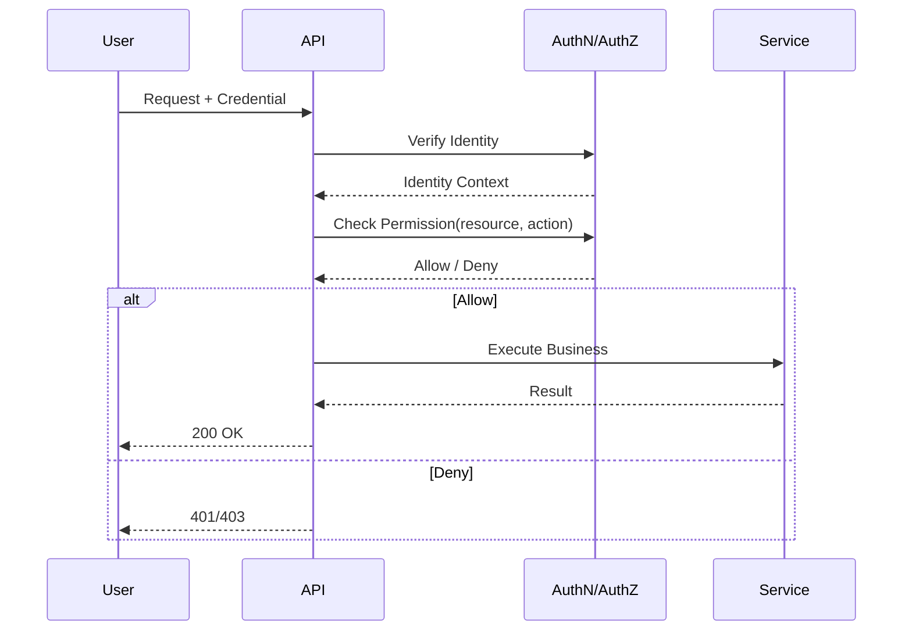
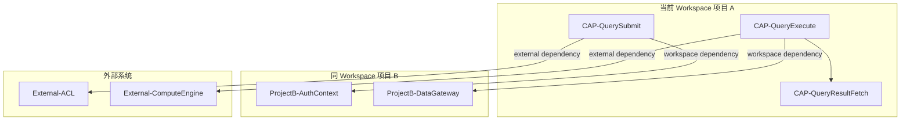
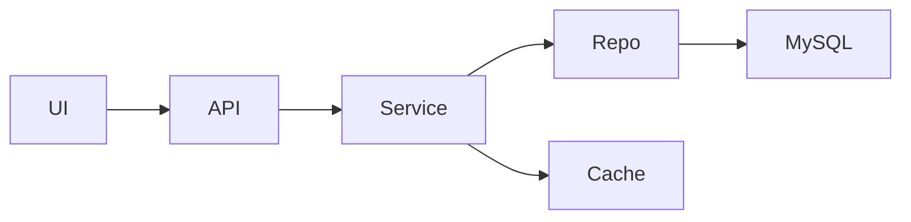
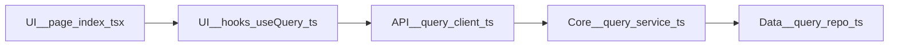

# 系统 Wiki 模板（DeepWiki 增强版）

> 文档目标：产出“全局架构 + 模块深描 + 文件引用关系”的可追溯项目解析。  
> 分析范围：`<workspace 或目录>`  
> 分析深度：`<quick | medium | very thorough>`  
> 更新时间：`<YYYY-MM-DD>`

---

## 0. 系统定位与核心功能快照（首屏必读）

### 0.1 一句话定位

这是一个面向 `<用户/系统>` 的 `<业务类型>` 系统，核心目标是 `<核心价值>`。

### 0.2 核心功能清单（Top 3~7）

| 功能名 | Capability ID | 用户价值 | 关键入口 | 状态 |
| --- | --- | --- | --- | --- |
| `<查询提交>` | `CAP-QuerySubmit` | `<缩短处理时延>` | `POST /query/submit` | `active` |
| `<查询执行>` | `CAP-QueryExecute` | `<提升执行成功率>` | `<internal trigger>` | `active` |
| `<历史逻辑>` | `CAP-LegacyX` | `<历史兼容>` | `<legacy route/cron>` | `legacy` |

### 0.3 业务主闭环（3~5 步）

`<触发>` -> `<处理>` -> `<产出>` -> `<消费/反馈>`

### 0.4 非目标与边界

- 不负责：`<系统不承担的职责>`
- 依赖外部：`<外部系统/团队能力>`

> 说明：后续第 4/6/8/10 章尽量回链 `Capability ID`，保证“系统做什么”的叙事主线不丢失。

## 1. 背景与范围

- 目标：`<本次分析目标>`
- In-Scope：`<纳入分析的目录/模块>`
- Out-of-Scope：`<排除项>`
- 方法：`<代码搜索 / 静态分析 / 关键链路追踪>`
- 假设与限制：`<信息盲区、仓库限制、权限限制>`

## 2. 系统分层与模块地图

| 层级 | 模块/目录 | 核心职责 | 关键依赖 | 关键入口 |
| --- | --- | --- | --- | --- |
| 表现层 | `<...>` | `<...>` | `<...>` | `<route/page/component>` |
| 业务层 | `<...>` | `<...>` | `<...>` | `<service/usecase>` |
| 数据层 | `<...>` | `<...>` | `<...>` | `<repo/dao/client>` |

## 3. 重点数据结构

| 名称 | 类型/位置 | 关键字段 | 使用方 | 生命周期 | 说明 |
| --- | --- | --- | --- | --- | --- |
| `<User>` | `<src/...>` | `<id,name,role>` | `<service-a,api-b>` | `<request-scope/persistent>` | `<...>` |

## 4. 数据流（主链路 + 支链路）

### 4.1 主链路

`<入口>` -> `<校验>` -> `<业务处理>` -> `<存储/下游>` -> `<输出>`  
关联能力：`<CAP-...>`

### 4.2 关键支链路

| 触发点 | 路径 | 与主链路关系 | 失败处理 | 观测点 |
| --- | --- | --- | --- | --- |
| `<...>` | `<...>` | `<...>` | `<...>` | `<log/metric/trace>` |

## 5. 权限控制流

| 阶段 | 控制点 | 规则来源 | 决策结果 | 失败行为 |
| --- | --- | --- | --- | --- |
| 身份识别 | `<...>` | `<token/session/sso>` | `<user-id>` | `<reject/log>` |
| 鉴权 | `<...>` | `<rbac/abac/acl>` | `<allow/deny>` | `<401/403>` |

## 6. 对外接口与能力原子关系图谱

> 重点注意：必须从“服务启动入口 + 外部输入接口”出发盘点能力，避免把过时旧代码误当成有效能力。

### 6.0 对外能力盘点基线（必填）

| Baseline Type | Entry/Location | Status | Evidence |
| --- | --- | --- | --- |
| service startup entry | `<src/main.ts>` | `<confirmed/pending>` | `<bootstrap call chain>` |
| external input interface | `<POST /api/query>` | `<confirmed/pending>` | `<route register + handler>` |
| external input interface | `<queue consumer: topic-x>` | `<confirmed/pending>` | `<consumer register>` |

### 6.1 原子能力关系图（必填）

### 6.2 原子能力关系清单（必填）

| Capability ID | 来源接口/入口 | 上游依赖 | 下游依赖 | 依赖类型 | 输入/输出 | 权限前置条件 |
| --- | --- | --- | --- | --- | --- | --- |
| `CAP-QuerySubmit` | `POST /query/submit` | `<caller>` | `<CAP-QueryExecute>` | `<internal/workspace/external>` | `<in/out>` | `<role/permission>` |
| `CAP-QueryExecute` | `<internal event>` | `<CAP-QuerySubmit>` | `<External-ComputeEngine>` | `<external>` | `<in/out>` | `<policy>` |

### 6.3 全量能力覆盖校验（必填）

| External Entry | Mapped Capability | Coverage Status | Notes |
| --- | --- | --- | --- |
| `<POST /api/query>` | `<CAP-QuerySubmit>` | `<covered/uncovered>` | `<...>` |
| `<cron: clean-job>` | `<CAP-CleanJobRun>` | `<covered/uncovered>` | `<...>` |

## 7. 依赖关系总览（内部/外部）

### 7.1 内部依赖图

| Source | Depends On | Type | Why |
| --- | --- | --- | --- |
| `<module-a>` | `<module-b>` | `<import/runtime>` | `<...>` |

### 7.2 外部依赖清单

| Internal Module | External Service/Package | Coupling Type | Risk |
| --- | --- | --- | --- |
| `<module-a>` | `<redis/mysql/xxx-sdk>` | `<client/sdk/protocol>` | `<...>` |

## 8. 模块深度解析（逐模块，DeepWiki 风格）

> 说明：核心模块不少于 3 个（微型项目除外）。先导航后展开，避免模块信息堆叠不可读。

### 8.0 模块导航（必填）

| 模块 | 职责一句话 | 关键入口 | 风险等级 |
| --- | --- | --- | --- |
| `M-01 <Module-A>` | `<...>` | `<...>` | `High/Medium/Low` |
| `M-02 <Module-B>` | `<...>` | `<...>` | `High/Medium/Low` |
| `M-03 <Module-C>` | `<...>` | `<...>` | `High/Medium/Low` |

> 建议在模块导航中附加“关联 Capability ID”（如 `CAP-QuerySubmit`），便于与第 0 章对齐。

### 8.1 [M-01] `<Module-A>`

**A. 模块概览**

| 字段 | 内容 |
| --- | --- |
| 模块ID | `M-01` |
| 职责 | `<做什么 / 不做什么>` |
| 入口 | `<API/Route/Event/Page>` |
| 出口 | `<DB/Queue/External Service>` |
| 关键数据结构 | `<XCommand>, <XResult>` |
| 风险等级 | `High/Medium/Low` |

**B. 关系与实现要点**

| 项 | 内容 |
| --- | --- |
| 依赖输入 | `<module-b>, <config-x>` |
| 对外输出 | `<module-c>, <event-y>` |
| 核心符号 | `<createX()>, <XService.execute>, <useX()>` |
| 典型调用链 | `<source> -> <module-a> -> <downstream>` |
| 变更风险 | `<高耦合点/隐式约束/回归风险>` |

**C. 关键文件（必填）**

| File | Role |
| --- | --- |
| `<src/module-a/index.ts>` | `<入口/装配>` |
| `<src/module-a/service.ts>` | `<核心编排>` |
| `<src/module-a/types.ts>` | `<模型定义>` |

**D. 证据（必填）**

| Evidence Type | File/Symbol | 说明 |
| --- | --- | --- |
| file | `<src/module-a/service.ts>` | `<实现核心编排>` |
| symbol | `<XService.execute>` | `<主执行入口>` |

### 8.2 [M-02] `<Module-B>`

> 按 `8.1` 模板继续填写。

### 8.3 [M-03] `<Module-C>`

> 按 `8.1` 模板继续填写。

## 9. 文件引用关系矩阵（必填）

### 9.1 文件关系图

### 9.2 文件关系表

| Source File | Target File | Relation Type | Symbol/Entry | Cross-Module | Evidence |
| --- | --- | --- | --- | --- | --- |
| `src/pages/query/index.tsx` | `src/hooks/useQuery.ts` | `import/use` | `useQuery` | `Yes` | `import + call site` |
| `src/hooks/useQuery.ts` | `src/api/query-client.ts` | `call` | `fetchQuery` | `Yes` | `function invocation` |
| `src/api/query-client.ts` | `src/core/query-service.ts` | `call` | `executeQuery` | `Yes` | `service delegation` |

> `Relation Type` 推荐值：`import/use`、`call`、`inherit/impl`、`config-bind`、`event-subscribe`、`io-dependency`。

## 10. 冗余代码与疑似废弃路径分析（必填）

> 说明：基于“能力盘点 + 可达链路”判定冗余，不只依赖静态引用关系。

### 10.1 疑似冗余清单

| Code Path/Symbol | Suspect Level | Why Suspect | Last Reachable Entry | Validation Plan |
| --- | --- | --- | --- | --- |
| `src/legacy/old-route.ts::registerOldRoutes` | `High` | `<not registered by active bootstrap>` | `<none>` | `<staging remove + 7d log watch>` |
| `src/jobs/legacy-clean.ts::run` | `Medium` | `<only referenced by deprecated scheduler>` | `<cron-v1>` | `<disable feature flag + metric observe>` |

### 10.2 冗余判定规则

- 判定依据：`无活跃入口`、`仅被过时入口引用`、`运行时调用统计为 0`、`被新能力完全替代`。
- 风险防护：必须给出可回滚策略（灰度、开关、回滚脚本、观测指标）。
- 输出结论格式：`Keep` / `Deprecate` / `Remove Candidate`。

## 11. 风险与待确认项

- 风险 1：`<...>`
- 风险 2：`<...>`
- Hypothesis：`<推测项 + 如何验证>`
- TODO：`<需补充的信息>`

## 12. 当前问题与建议优化方向

### 12.1 当前问题

- 问题 1：`<链路过长/职责耦合/鉴权分散/重复依赖>`
- 问题 2：`<模块边界不清/文件互引复杂>`

### 12.2 建议优化方向

| 优化项 | 目标 | 影响范围 | 预期收益 | 实施优先级 |
| --- | --- | --- | --- | --- |
| `<能力解耦>` | `<降低耦合>` | `<模块A/B>` | `<可维护性提升>` | `<P0/P1/P2>` |
| `<权限收敛>` | `<统一鉴权策略>` | `<API/Service>` | `<安全性与一致性>` | `<P0/P1/P2>` |
| `<文件关系治理>` | `<降低跨层直连>` | `<核心链路文件>` | `<变更风险降低>` | `<P0/P1/P2>` |

---

## 附：质量检查清单（交付前自检）

- [ ] 每一章至少包含具体模块名或文件路径，不出现泛化空话。
- [ ] 图和表一致（图中的关键边在表中可查）。
- [ ] 模块章节包含证据（文件/符号）且可追溯。
- [ ] 已区分事实与假设（`Hypothesis` 明确标注）。
- [ ] 若信息不足，已列 TODO，不伪造结论。
- [ ] 能力清单从启动入口和外部输入接口出发，覆盖状态明确。
- [ ] 冗余代码条目包含验证方案和回滚/观测策略。
